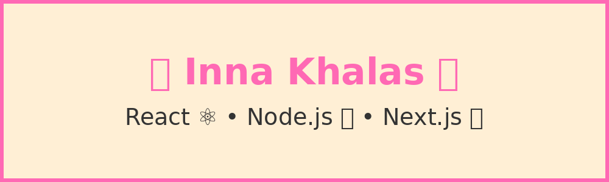

<h1 align="center">Hi there 👋, I'm Inna Khalas</h1>
<h3 align="center">Fullstack Developer | React | Node.js | Next.js</h3>

  

---

### 👩‍💻 About Me

- 🔭 I’m currently working on **AI voice assistant app**
- 🌱 I’m currently learning **WebSockets**, **GraphQL**
- 💬 Ask me about **React**, **Node.js**, **Next.js**
- 📫 How to reach me: `inna.khalas@example.com`
- ⚡ Fun fact: I love solving frontend puzzles and UI challenges!

---

### 🛠️ Technologies & Tools

---

### 📈 GitHub Stats

  
  

---

### 🔗 Connect With Me

  
  

